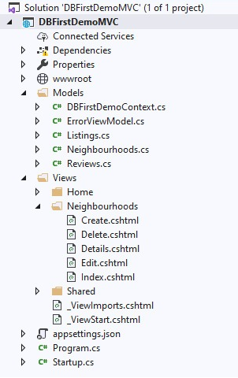

# Inleiding
Dit onderzoek is geschreven voor de kennissessie: **Workshop Performance en Security** en ter ondersteuning van het ontwikkelproces voor de InsideAirBn webapplicatie. Er zal onderzoek gedaan worden naar een onderwerp betreft Performance en een onderwerp betreft Security.

# Opzet onderzoek
Het te onderzoeken onderwerp betreft Performance is ***Entity Framework/Repository pattern*** en het onderwerp betreft Security is ***Sensitive Data Exposure***. Elk onderwerp heeft vooraf bepaalde deelvragen die beantwoord zullen worden. Deze deelvragen zijn:

## Performance
**Wat is het?**<br/>
    *Onderzoeksmethode: bieb*

**Hoe werkt het?**<br/>
    *Onderzoeksmethode: bieb*

**Hoe implementeer je het?**<br/>
    *Onderzoeksmethode: bieb en lab*

## Security
**Wat is het?**<br/>
    *Onderzoeksmethode: bieb*

**Hoe werkt het?**<br/>
    *Onderzoeksmethode: bieb*

**Hoe merk je het?**<br/>
    *Onderzoeksmethode: bieb*

**Hoe voorkom je het?**<br/>
    *Onderzoeksmethode: bieb*

**Hoe implementeer je het?**<br/>
    *Onderzoeksmethode: bieb en lab*

# Entity Framework
## Wat is het Entity Framework?
Om te kunnen communiceren met een database, is een persistence framework nodig. Met een persistence framework kunnen er CRUD operaties uitgevoerd worden op een database. Het is mogelijk om dit zelf te schrijven met [ADO.NET](https://nl.wikipedia.org/wiki/ADO.NET) classes zoals `SqlConnection`, `SqlCommand` en `SqlDataReader`. Maar dit kost erg veel tijd omdat je dan zelf deze data in de database moet inlezen en omzetten naar bruikbare objecten.

Hiervoor is het Entity Framework ontwikkeld. Het Entity Framework is een open-source ORM framework voor .NET applicaties dat developers helpt met het communiceren met een database en ervoor zorgt dat alle bovenstaande acties niet zelf meer hoeven worden uitgevoerd. 

<br/>
<em>Figuur 1: Entity Framework structuur</em>

In bovenstaand figuur is te zien waar het Entity Framework pas in de structuur van de applicatie. Er kan gewerkt worden met data met gebruik van objecten of domein specifieke classes zonder te hoeven focussen op de onderliggende database waar deze data staat opgeslagen. Hierdoor kan er op een hoger abstractieniveau omgegaan worden met deze data en is het mogelijk om applicaties te ontwikkelen met minder code en welke gemakkelijker te onderhouden zijn.

## Hoe werkt het Entity Framework?
Het Entity Framework werkt doormiddel van het mappen van een class naar de database. Deze class heet een `Context class`, en wordt altijd afgeleid van `DbContext`. In deze context classes worden domein specifieke classes (Entities) gebruikt doormiddel van een generic genaamd `DbSet<TEntity>`

<br/>
<em>Figuur 2: Voorbeeld DbSet</em>

Om een entity te maken maak je eerst een class aan dat een databasetabel mapped. Als dit gedaan is, moet het eerst in een context class gezet worden doormiddel van de voorheen besproken `DbSet<TEntity>`. Wanneer deze context en entity classes aangemaakt zijn kunnen er queries geschreven worden. Deze queries worden geschreven met LINQ queries. Dit is de query taal die gebruikt wordt binnen .NET. 

<br/>
<em>Figuur 3: Voorbeeld LINQ query</em>

Het entity framework zal deze LINQ queries omzetten naar SQL queries, de database voert deze SQL queries uit en stuurt dan het resultaat terug. Het Entity Framework zet dit resultaat dan om naar Entity Objects.

Het transformeren en vertalen van deze informatie wordt gedaan door het EDM (Entity Data Model). Het EDM staat binnen het Entity Framework en geeft een in-memory representatie van de gehele metadata. Deze metadata wordt in drie verschillende onderdelen opgedeeld: 

- **Conceptual model**<br/>
EF bouwt het conceptual model uit de domein classes, context class, standaard conventies van de domein classes, en configuraties.

- **Storage model**<br/>
EF bouwt het storage modal voor de onderliggende databaseschema. Bij het gebruik van code-first wordt er uitgegaan van het conceptual model. Bij het gebruik van database-first wordt er uitgegaan van de bestaande database.

- **Mappings**<br/>
EF bevat informatie over hoe het conceptual model mapped naar het databaseschema (storage model).

Deze drie worden samen gebruikt bij het uitvoeren van CRUD operaties op de database en het transformeren van de query resultaten naar Entity Objects.

## Hoe implementeer je het Entity Framework?
In dit voorbeeld wordt er uitgegaan van een Database First implementatie. Bij een Database first implementatie van het Entity framework wordt er eerst een database aangemaakt met daarin een of meerdere tabellen. 

<br/>
<em>Figuur 4: Voorbeeld database</em>

Hierna kan er een applicatie aangemaakt worden. Wanneer deze applicatie is aangemaakt, moeten er een aantal packages geïnstalleerd worden. Ga naar `Tools > NuGet Package Manager > Manage NuGet Packages for Solution`. 

<br/>
<em>Figuur 5: Package manager</em>


zoek in de search bar naar `microsoft.entityframeworkcore` en selecteer het eerste resultaat. Zorg dat `Include prerelease` is aangevinkt. Kies dan het project in het rechterscherm en selecteer de juiste preview versie van de package, wanneer dit gedaan is klik dan op install. Herhaal dit proces voor `microsoft.entityframeworkcore.tools` en `microsoft.entityframeworkcore.sqlserver`. 

<br/>
<em>Figuur 6: Installeren packages</em>

Wanneer deze zijn geïnstalleerd ga dan naar `Tools > NuGet Package Manager > Package Manager Console`. In deze console wordt het volgende ingevoerd: `Scaffold-DbContext "Server=[SERVER_NAME];Database=DBFirstDemo;Trusted_Connection=True;" Microsoft.EntityFrameworkCore.SqlServer -OutputDir [DIRECTORY_NAME].` [SERVER_NAME] moet vervangen worden met de servernaam van de SQL Server, de [DIRECTORY_NAME] kan gewijzigd worden naar een map naar keuze.

Als dit command klaar is met uitvoeren, zijn er nieuwe bestanden aangemaakt voor de entities en context class. Er wordt voor elke tabel een entity aangemaakt. In dit voorbeeld is gekozen voor de Root directory van het project hiervoor is `-OutputDir [DIRECTORY_NAME]` weggelaten. Deze ziet er hierna zo uit:

<br/>
<em>Figuur 7: Overzicht gegenereerde bestanden</em>

Daarna kun je met de gemaakte `DBContext` class CRUD operaties uitvoeren op de database. Deze class zal een één of meerdere `DBSets` bevatten afhankelijk van het aantal tabellen in de database. Omdat deze `DBSets` zich gedragen als een collectie, is het mogelijk om alle soorten LINQ queries te gebruiken om objecten te vinden.

```c#
DBFirstDemoContext context = new DBFirstDemoContext(); //Instantie van context aanmaken
```
```c#
//Neighbourhood aanmaken
var newNeighbourhood = new Neighbourhoods()
{
    Neighbourhood = "NewNeighbourhood"
};
context.Neighbourhoods.Add(newNeighbourhood); //Neighbourhood toevoegen
context.SaveChanges(); //Wijzigingen opslaan
```
```c#
var foundNeighbourhood = context.Neighbourhoods.Find(newNeighbourhood.NeighbourhoodId); //Neighbourhood vinden met primary key

var foundNeighbourhoods = context.Neighbourhoods.Where(n => n.Neighbourhood.ToLower().Contains("a")); //Alle Neighbourhoods vinden met de letter a

foundNeighbourhood.Neighbourhood = "UpdatedNeighbourhood"; //Properties aanpassen

context.SaveChanges(); //Wijzigingen opslaan
```
```c#
context.Neighbourhoods.Remove(foundNeighbourhood); //Bestaande Neighbourhood verwijderen

context.Neighbourhoods.RemoveRange(foundNeighbourhoods); //Meerdere Neighbourhoods verwijderen

context.SaveChanges(); //Wijzigingen opslaan
```
# Repository Pattern
## Wat is het Repository Pattern?
Het Repository Pattern is een veel gebruikt pattern om duplicatie van data access logica binnen een applicatie te voorkomen. Denk hierbij bijvoorbeeld aan het communiceren met een database. Het biedt een abstractie van gegevens zodat de applicatie kan werken met een interface dat de interface van een collection van entities benadert. 

Het uitvoeren van CRUD operaties op deze collection gebeurd dan via een aantal simpele methoden, zonder bezig te hoeven zijn met database gerelateerde taken zoals de connectie en queries. Onderstaand de voordelen van het Repository Pattern:
- Het voorkomt het dupliceren van querylogica.
- Het ontkoppelt de applicatie van persistence frameworks (zoals bijvoorbeeld [Entity Framework](#entity-framework)).
- Het maakt de applicatie beter testbaar.

## Hoe werkt het Repository Pattern? 
Het repository pattern zorgt voor een extra laag abstractie over de data access laag, in ons geval houdt dat in dat wij met behulp van het repository pattern extra abstractie willen bij het maken van CRUD operaties. 

Om het repository pattern toe te passen is er een repository nodig, een repository is een interface voor een verzameling objecten in het geheugen. Vervolgens is er een klasse nodig dat dit interface implementeert dat een generic `DbContext` bevat. Deze kan vervolgens ook in andere applicaties gebruikt worden.

In het geval van onze applicatie zal er voor elk entity een repository aangemaakt worden dat dit generic interface implementeert. Hier kunnen dan extra methoden worden toegevoegd die afhankelijk zijn van de toepassingscontext. Als laatste is er dan nog een klasse nodig die de functionaliteit van deze extra methoden bevat.

<br/>
<em>Figuur 8: Voorbeeld repository implementatie</em>

Merk op dat er bovenstaand geen methode aanwezig is om een object te updaten. Dit is namelijk een veelgemaakte fout. Als een object aangepast moet worden is het de bedoeling dat deze uit de collectie wordt gehaald met de `Get(id)` methode en vervolgens wordt aangepast. Nogmaals, een repository moet zich gedragen als een collectie van objecten. een `List` heeft geen methode om een object te updaten, daarom heeft een repository dit ook niet.

Om de wijzigingen aan deze collectie op te slaan in een database, wordt gebruik gemaakt van het Unit of Work Pattern. Een Unit of Work houdt een of meerdere soorten collecties bij van objecten waar CRUD operaties op zijn uitgevoerd. Een Unit of Work bevat een `Save()` methode dat verantwoordelijk is voor het opslaan van deze wijzigingen in een database.

## Hoe implementeer je het Repository Pattern?
Om het Repository pattern te implementeren begin je met het aanmaken van een Entity framework applicatie zoals beschreven in het [Entity framework hoofdstuk](hoe-implementeer-je-het-entity-framework).

<!-- Wanneer deze applicatie is aangemaakt moet er een Repository aangemaakt worden, dit wordt gedaan door een map genaamd Repositories aan te maken en daarin een generic interface in te zetten waarbij T verwijst naar een entity.
Vervolgens worden hier SELECT, INSERT en DELETE operaties in aangemaakt zoals hieronder staat afgebeeld. De UPDATE en SAVE moeten buiten de repository aangemaakt worden. -->

Wanneer deze applicatie is aangemaakt moeten er een aantal classes en interfaces aangemaakt worden. In onderstaand voorbeeld worden deze in de map "Repositories" geplaatst.

<br/>
<em>Figuur 9: Overzicht Repository bestanden</em>

Maak eerst een nieuwe interface aan met de naam `IRepository`. Deze krijgt vervolgens onderstaande methoden:

```c#
public interface IRepository<TEntity> where TEntity : class //zorgt ervoor dat er alleen een repository aangemaakt kan worden voor classes
{
    TEntity Get(int id); //Vind een enitity met primary key
    IEnumerable<TEntity> GetAll(); //Alle entities in repository ophalen
    IEnumerable<TEntity> Find(Expression<Func<TEntity, bool>> predicate); //Vind meerdere entities met een predicate

    void Add(TEntity entity); //Entity toevoegen aan de repository
    void AddRange(IEnumerable<TEntity> entities); //Meerdere entities toevoegen aan de repository

    void Remove(TEntity entity); //Entity verwijderen uit de repository
    void RemoveRange(IEnumerable<TEntity> entities); //Meerdere entities verwijderen uit de repository
}
```
Vervolgens, maak een `Repository` class aan. Zorg ervoor dat deze het zojuist aangemaakte interface implementeert. Vergeet niet om `where TEntity : class` toe te voegen. 

```c#
    public class Repository<TEntity> : IRepository<TEntity> where TEntity : class
    {
        protected readonly DbContext context;

        public Repository(DbContext context)
        {
            this.context = context;
        }

        public TEntity Get(int id)
        {
            return context.Set<TEntity>().Find(id);
        }

        public IEnumerable<TEntity> GetAll()
        {
            return context.Set<TEntity>().ToList();
        }

        public IEnumerable<TEntity> Find(Expression<Func<TEntity, bool>> predicate)
        {
            return context.Set<TEntity>().Where(predicate);
        }


        public void Add(TEntity entity)
        {
            context.Set<TEntity>().Add(entity);
        }

        public void AddRange(IEnumerable<TEntity> entities)
        {
            context.Set<TEntity>().AddRange(entities);
        }


        public void Remove(TEntity entity)
        {
            context.Set<TEntity>().Remove(entity);
        }

        public void RemoveRange(IEnumerable<TEntity> entities)
        {
            context.Set<TEntity>().RemoveRange(entities);
        }
    }
```
Het mooie aan bovenstaande classes is dat deze generic zijn. Hierdoor kunnen ze in elke applicatie hergebruikt worden.

De volgende stap is om een repository interface te maken voor elke `DBSet`. Dit interface extend het `IRepository` interface met een concrete entity en zal methoden bevatten die gebruikt worden om queries te encapsulaten. Onderstaand voorbeeld is voor de `Neighbourhoods` table.

```c#
public interface INeighbourhoodRepository : IRepository<Neighbourhoods>
{
    IEnumerable<Neighbourhoods> GetNeighbourhoodsContainingString(string indexString); //Extra methode om neighbourhoods te filteren
}
```
Om vervolgens alle classes en interfaces aan elkaar te koppelen moet er een class gemaakt worden dat bovenstaand interface implementeert en de `Repository` class extend.

```c#
public class NeighbourhoodRepository : Repository<Neighbourhoods>, INeighbourhoodRepository
{
    public DBFirstDemoContext DemoContext
    {
        get { return context as DBFirstDemoContext; }
    }

    public NeighbourhoodRepository(DBFirstDemoContext context) : base(context)
    {
    }

    public IEnumerable<Neighbourhoods> GetNeighbourhoodsContainingString(string indexString)
    {
        return DemoContext.Neighbourhoods.Where(n => n.Neighbourhood.ToLower().Contains("a"));
    }
}
```
Het is mogelijk om deze classes nu zo te gebruiken:
```c#
//Neighbourhood aanmaken
var newNeighbourhood = new Neighbourhoods()
{
    Neighbourhood = "NewNeighbourhood"
};

//Repository aanmaken
var neighBourHoodRespository = new NeighbourhoodRepository(new DBFirstDemoContext());

neighBourHoodRespository.DemoContext.Neighbourhoods.Add(newNeighbourhood); //Neighbourhood toevoegen

//Wijzigingen opslaan
neighBourHoodRespository.DemoContext.SaveChanges();
```
Dit is echter ongewenst. Dan zou je dus overal waar je dit repository nodig hebt, steeds een nieuwe instantie aan moeten maken.

Een oplossing hiervoor is het Unit of Work pattern. Hier is een interface en een class voor nodig. Deze zijn verschillend per applicatie omdat er gebruik wordt gemaakt van alle Repository interfaces zoals bijvoorbeeld `INeighbourhoodRepository`.

Maak eerst een `IUnitOfWork` interface aan zoals onderstaand voorbeeld:

```c#
public interface IUnitOfWork : IDisposable
{
    INeighbourhoodRepository Neighbourhoods { get; }
    int Complete();
}
```
Maak daarna een `UnitOfWork` class die dit interface implementeert:

```c#
public class UnitOfWork : IUnitOfWork
{
    private readonly DBFirstDemoContext context;
    public INeighbourhoodRepository Neighbourhoods { get; private set; }
    //Voeg hier extra repositories toe

    public UnitOfWork(DBFirstDemoContext context)
    {
        this.context = context;
        Neighbourhoods = new NeighbourhoodRepository(context);
    }

    public int Complete()
    {
        return context.SaveChanges();
    }

    public void Dispose()
    {
        context.Dispose();
    }
}
```
Nu is het dus mogelijk om meerdere CRUD operaties uit te voeren op verschillende repositories en vervolgens de `Complete` methode te gebruiken om deze wijzigingen op te slaan.

```c#
using (UnitOfWork unitOfWork = new UnitOfWork(new DBFirstDemoContext()))
{
    //Neighbourhood aanmaken
    var newNeighbourhood = new Neighbourhoods()
    {
        Neighbourhood = "NewNeighbourhood"
    };
    unitOfWork.Neighbourhoods.Add(newNeighbourhood); //Neighbourhood toevoegen

    unitOfWork.Complete(); //Wijzigingen opslaan
}
```
# Sensitive Data Exposure

## Wat is het?
## Hoe werkt het?
## Hoe merk je het?
## Hoe voorkom je het?
## Hoe implementeer je het?

## Entity Framework
https://www.entityframeworktutorial.net/what-is-entityframework.aspx

https://www.youtube.com/watch?time_continue=3&v=ZX7_12fwQLU&feature=emb_logo

https://www.entityframeworktutorial.net/efcore/install-entity-framework-core.aspx

https://www.entityframeworktutorial.net/efcore/create-model-for-existing-database-in-ef-core.aspx

## Repository Pattern
https://www.youtube.com/watch?time_continue=1&v=rtXpYpZdOzM&feature=emb_logo

https://www.infragistics.com/community/blogs/b/dhananjay_kumar/posts/how-to-implement-the-repository-pattern-in-asp-net-mvc-application

https://dev.to/kylegalbraith/getting-familiar-with-the-awesome-repository-pattern--1ao3

https://medium.com/@pererikbergman/repository-design-pattern-e28c0f3e4a30

## Sensitive Data Exposure